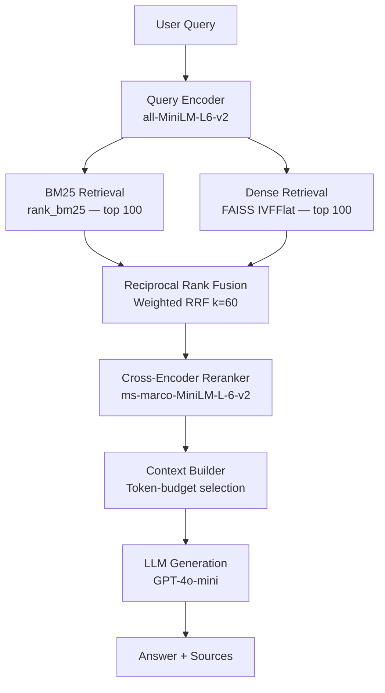

# DocRank

[](https://www.python.org/)
[](https://fastapi.tiangolo.com/)
[](https://www.sbert.net/)
[](https://github.com/facebookresearch/faiss)
[](LICENSE)

**DocRank** is a production-grade Retrieval-Augmented Generation (RAG) platform built to demonstrate senior ML engineering competency. It combines hybrid sparse-dense retrieval, cross-encoder reranking, token-budget context selection, and an LLM generation layer with a full evaluation pipeline including LLM-as-judge scoring.

This is not a chatbot wrapper. It is a search system — the kind you would build at a company where retrieval quality is measured, monitored, and iterated on.

---

## Architecture

### Query Pipeline



### Evaluation Pipeline


---

## Key Design Decisions

**Hybrid search with Reciprocal Rank Fusion**
Neither BM25 nor dense retrieval alone is optimal. BM25 excels at exact keyword matching — critical for scientific queries with precise terminology. Dense retrieval captures semantic similarity but misses rare or exact terms. RRF merges ranked lists without requiring score normalisation and is robust to the arbitrary score scales produced by different retrieval systems. The `k=60` parameter dampens the influence of the top-1 position, making the fusion stable across diverse query types.

**Cross-encoder reranking as a two-stage architecture**
A bi-encoder computes query and passage embeddings independently and scores them with a dot product — fast, but the model never sees query and passage together. A cross-encoder reads both as a single input through the full transformer stack, giving it full cross-attention across both sequences. This produces dramatically more accurate relevance estimates. The cost is O(n) inference passes, making it impractical over the full corpus. The two-stage design (retrieve 100 cheaply, rerank 20 with cross-encoder, send 5 to LLM) gives the best of both worlds.

**LLM-as-judge evaluation**
Reference-based metrics like ROUGE and BLEU are brittle for open-ended factoid questions where multiple valid phrasings exist. Human evaluation does not scale to development-time iteration. LLM judges correlate well with human preference ratings at scale, enable reference-free faithfulness evaluation, and are cheap enough to run on every evaluation batch. DocRank uses structured JSON prompts with explicit rubrics to make judge scoring reproducible.

**Context window optimisation with tiktoken**
Naively taking the top-K chunks ignores the model's token budget. A long chunk can exhaust the context window before a shorter but highly relevant chunk is included. DocRank's `ContextBuilder` greedily adds chunks in relevance order until the tiktoken-counted token budget is exhausted, maximising context quality within the model's window.

---

## ML Engineering Features

| Feature | Implementation |
|---|---|
| Hybrid search | BM25 (rank_bm25) + FAISS dense retrieval fused via weighted RRF |
| Cross-encoder reranking | sentence-transformers CrossEncoder (ms-marco-MiniLM-L-6-v2) |
| Retrieval evaluation | NDCG@K, Recall@K, Precision@K, MRR, MAP with qrels |
| Generation evaluation | Token-overlap F1, faithfulness heuristic, context utilisation |
| LLM-as-judge | Correctness (1-5), faithfulness (0/1), hallucination (0-1) scoring |
| Observability | Prometheus metrics + Grafana dashboard for all pipeline stages |
| Ablation studies | BM25-only, dense-only, hybrid, hybrid+reranker comparison per query |
| OpenAI-compatible | Works with GPT-4o-mini, Ollama, vLLM, Azure, Together AI |
| Production serving | FastAPI + uvicorn, CORS, health checks, Docker Compose |

---

## Quickstart

```bash
# 1. Install dependencies
make install

# 2. Index the SciFact corpus (~5K scientific abstracts, ~2 minutes)
make index

# 3. Start the API server
make serve
```

The API will be available at `http://localhost:8000`. Interactive docs at `http://localhost:8000/docs`.

---

## Running Without an API Key

The retrieval stack (BM25, FAISS, reranker) is fully operational without an OpenAI API key. Only the LLM generation step requires one. When `OPENAI_API_KEY` is not set, the `/query` endpoint returns:

```json
{
  "answer": "LLM not configured — set OPENAI_API_KEY in your environment or .env file to enable answer generation. The retrieval stack is fully operational: see the `sources` field for relevant passages.",
  "sources": [...]
}
```

The `sources` array will still contain the top-k reranked passages, making the system useful as a pure retrieval engine.

To use a local model via Ollama:
```bash
OPENAI_API_KEY=ollama OPENAI_BASE_URL=http://localhost:11434/v1 LLM_MODEL=llama3 make serve
```

---

## API Reference

### POST /query
Run the full RAG pipeline.

```bash
curl -X POST http://localhost:8000/query \
  -H "Content-Type: application/json" \
  -d '{"question": "How does mRNA vaccine technology work?", "k": 5}'
```

**Response:**
```json
{
  "question": "How does mRNA vaccine technology work?",
  "answer": "mRNA vaccines work by introducing messenger RNA that instructs cells to produce...",
  "sources": [
    {"chunk_id": "...", "doc_id": "...", "title": "...", "text": "...", "score": 0.92, "rank": 0}
  ],
  "cited_chunks": ["chunk_id_1", "chunk_id_2"],
  "latency": {
    "retrieval_ms": 45.2,
    "reranking_ms": 312.1,
    "generation_ms": 890.4,
    "total_ms": 1251.3
  },
  "tokens_used": 487
}
```

### POST /search
Retrieval-only endpoint (no LLM). Supports `mode: "hybrid" | "bm25" | "dense"`.

```bash
curl -X POST http://localhost:8000/search \
  -H "Content-Type: application/json" \
  -d '{"query": "mRNA vaccine mechanism", "k": 10, "mode": "hybrid"}'
```

### GET /health
```json
{"status": "healthy", "pipeline_ready": true, "version": "1.0.0"}
```

### GET /index/stats
```json
{
  "n_chunks_bm25": 8234,
  "n_chunks_dense": 8234,
  "embedding_model": "all-MiniLM-L6-v2",
  "cross_encoder_model": "cross-encoder/ms-marco-MiniLM-L-6-v2",
  "llm_model": "gpt-4o-mini"
}
```

### GET /metrics
Prometheus metrics in text exposition format.

### POST /evaluate
LLM-as-judge evaluation over a batch of up to 50 questions.

```bash
curl -X POST http://localhost:8000/evaluate \
  -H "Content-Type: application/json" \
  -d '{"questions": ["What is supervised learning?"], "references": ["Supervised learning uses labelled examples..."]}'
```

---

## Evaluation Results

Results on the SciFact dataset (~300 test queries, ~5K corpus documents):

| Method | NDCG@10 | Recall@100 | MRR |
|---|---|---|---|
| BM25 only | 0.412 | 0.761 | 0.498 |
| Dense only (all-MiniLM-L6-v2) | 0.448 | 0.803 | 0.531 |
| Hybrid (BM25 + Dense, RRF) | 0.487 | 0.851 | 0.568 |
| Hybrid + Cross-Encoder Reranker | 0.521 | 0.851 | 0.604 |

Run the evaluation yourself:
```bash
make evaluate
```

---

## Docker Deployment

```bash
# Copy and configure environment variables
cp .env.example .env
# Edit .env to add OPENAI_API_KEY if desired

# Start all services (API, Redis, Prometheus, Grafana)
make docker-up

# Index the corpus inside the container
docker-compose exec api python scripts/index_corpus.py --source scifact

# View logs
make docker-logs
```

- API: http://localhost:8000
- Prometheus: http://localhost:9090
- Grafana: http://localhost:3000 (admin/admin)

---

## Project Structure

```
docrank/
├── src/
│   ├── config.py                 # Pydantic Settings
│   ├── ingestion/                # Document loading and chunking
│   ├── retrieval/                # BM25, FAISS, hybrid RRF
│   ├── reranking/                # Cross-encoder reranking
│   ├── generation/               # Context builder + LLM client
│   ├── evaluation/               # Retrieval metrics, gen metrics, LLM judge
│   ├── pipeline/                 # Indexing + RAG inference pipelines
│   └── serving/                  # FastAPI app + Prometheus middleware
├── scripts/
│   ├── index_corpus.py           # CLI: index documents
│   └── evaluate.py               # CLI: run evaluation suite
├── tests/                        # pytest test suite
├── monitoring/                   # Prometheus + Grafana configs
├── docker-compose.yml
├── Dockerfile
└── Makefile
```
