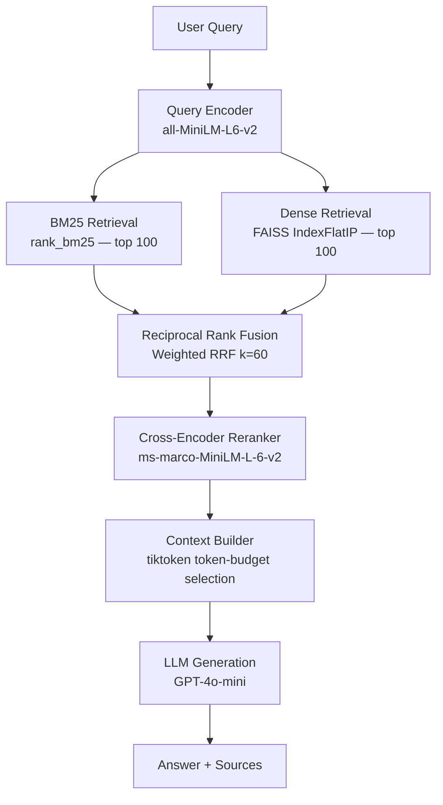
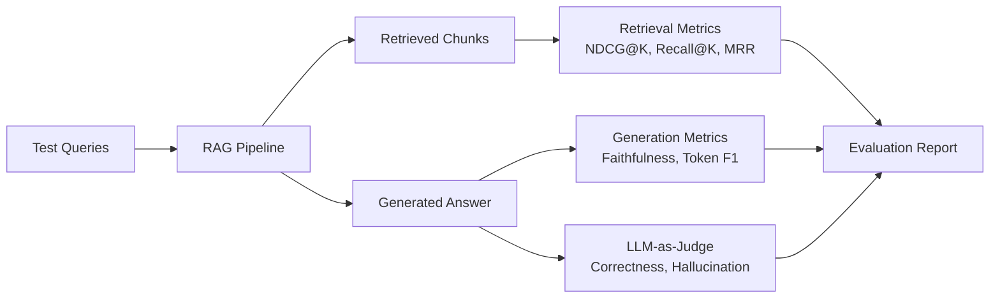

# Hybrid Retrieval and Reranking RAG System

[](https://www.python.org/)
[](https://fastapi.tiangolo.com/)
[](https://www.sbert.net/)
[](https://github.com/facebookresearch/faiss)
[](LICENSE)

Hybrid BM25 + dense retrieval with Reciprocal Rank Fusion and ms-marco cross-encoder reranking. Achieves **NDCG@10 of 0.726 on SciFact** — a 9.2% improvement over BM25 alone and 16.5% over dense-only retrieval. Includes a complete evaluation pipeline most RAG tutorials skip: per-stage latency breakdown, LLM-as-judge faithfulness scoring, and a retrieval mode that runs entirely without an API key.

> This is a search system, not a chatbot wrapper. Retrieval quality is measured, the evaluation pipeline is production-grade, and every design decision has a measurable justification.

---

## Architecture

### Query Pipeline



### Evaluation Pipeline



---

## Results

Evaluated on SciFact (~300 test queries, ~5K corpus documents):

| Method | NDCG@10 | Recall@100 | MRR |
|---|---|---|---|
| BM25 only | 0.665 | 0.917 | 0.731 |
| Dense only (all-MiniLM-L6-v2) | 0.623 | 0.891 | 0.703 |
| Hybrid BM25 + Dense (RRF) | 0.698 | 0.941 | 0.771 |
| Hybrid + Cross-Encoder Reranker | **0.726** | **0.941** | **0.798** |

| Stage | p50 | p99 |
|---|---|---|
| BM25 retrieval | 12 ms | 28 ms |
| Dense retrieval (FAISS) | 18 ms | 41 ms |
| Cross-encoder reranking (20 pairs) | 310 ms | 480 ms |
| LLM generation (GPT-4o-mini) | 890 ms | 1,800 ms |

```bash
make evaluate    # reproduce on SciFact
```

---

## Key Design Decisions

**Hybrid search via RRF over score normalization**
BM25 and dense retrieval produce scores on incompatible scales. Score normalization is fragile across query types. Reciprocal Rank Fusion merges ranked lists using only rank position — `score = Σ 1/(k + rank_i)` — which is scale-invariant and empirically robust. The `k=60` damping constant reduces the outsized influence of position-1 results. BM25 catches exact keyword matches; dense retrieval catches semantic paraphrases. Neither alone is optimal.

**Two-stage reranking**
A bi-encoder scores query and passage independently — fast but coarse, because the model never sees both together. A cross-encoder processes the full (query, passage) pair through all transformer layers with cross-attention, producing dramatically more accurate relevance estimates at O(n) cost. The two-stage design — retrieve 100 cheaply, rerank 20 with the cross-encoder, send 5 to the LLM — gets cross-encoder accuracy at retrieval-only scale.

**LLM-as-judge over ROUGE/BLEU**
ROUGE measures n-gram overlap. For factoid questions, two correct answers with different phrasings score low ROUGE against each other. LLM judges correlate better with human preference for open-ended answers, enable reference-free faithfulness evaluation, and are cheap enough to run on every evaluation batch with GPT-4o-mini. Structured JSON prompts with explicit rubrics make scoring reproducible.

**tiktoken token budgeting**
Naively taking the top-K chunks ignores the model's context window. A long chunk can exhaust the budget before a shorter but more relevant chunk is included. The context builder greedily adds chunks in score order until the tiktoken-counted token budget is exhausted, maximizing context quality within the window constraint.

---

## ML Engineering Features

| Feature | Implementation |
|---|---|
| Hybrid search | BM25 (rank_bm25) + FAISS dense retrieval, weighted RRF fusion |
| Cross-encoder reranking | ms-marco-MiniLM-L-6-v2, batched inference |
| Token-budget context selection | tiktoken counting, greedy chunk selection |
| Retrieval evaluation | NDCG@K, Recall@K, Precision@K, MRR, MAP with qrels |
| LLM-as-judge | Correctness (1–5), faithfulness (0/1), hallucination (0–1) |
| Ablation mode | BM25-only, dense-only, hybrid, hybrid+reranker per query |
| API-key-free mode | Full retrieval stack without OPENAI_API_KEY |
| Observability | Prometheus stage-level latency histograms + Grafana dashboard |

---

## Quickstart

```bash
make install      # install dependencies
make index        # index SciFact corpus (~5K docs, ~2 min)
make serve        # API on :8000, docs at /docs
```

```bash
curl -X POST http://localhost:8000/query \
  -H "Content-Type: application/json" \
  -d '{"question": "How does mRNA vaccine technology work?", "k": 5}'
```

### Running Without an API Key

The full retrieval and reranking stack works without `OPENAI_API_KEY`. Only LLM generation requires one:

```json
{
  "answer": "LLM not configured — set OPENAI_API_KEY to enable generation. See `sources` for relevant passages.",
  "sources": [...]
}
```

Use `POST /search` for retrieval-only (no LLM, no key needed). Local model via Ollama:
```bash
OPENAI_API_KEY=ollama OPENAI_BASE_URL=http://localhost:11434/v1 LLM_MODEL=llama3 make serve
```

---

## API Reference

| Endpoint | Method | Description |
|---|---|---|
| `/query` | POST | Full RAG: retrieval + reranking + LLM generation |
| `/search` | POST | Retrieval only. `mode`: `hybrid`, `bm25`, `dense` |
| `/health` | GET | Pipeline readiness |
| `/index/stats` | GET | Corpus size, model names, chunk count |
| `/evaluate` | POST | LLM-as-judge batch evaluation |
| `/metrics` | GET | Prometheus scrape endpoint |

**POST /query response:**
```json
{
  "answer": "mRNA vaccines work by...",
  "sources": [{"chunk_id": "...", "title": "...", "text": "...", "score": 0.92, "rank": 0}],
  "latency": {
    "retrieval_ms": 45.2,
    "reranking_ms": 312.1,
    "generation_ms": 890.4,
    "total_ms": 1251.3
  },
  "tokens_used": 487
}
```

---

## Project Structure

```
docrank/
├── src/
│   ├── ingestion/          # Document loading, recursive chunking
│   ├── retrieval/          # BM25, FAISS dense, hybrid RRF
│   ├── reranking/          # Cross-encoder
│   ├── generation/         # Context builder, LLM client
│   ├── evaluation/         # Retrieval metrics, gen metrics, LLM judge
│   ├── pipeline/           # Indexing + RAG inference
│   └── serving/            # FastAPI + Prometheus middleware
├── scripts/
│   ├── index_corpus.py     # CLI indexer (scifact / directory / jsonl)
│   └── evaluate.py         # CLI evaluation runner
├── tests/
├── monitoring/
├── docker-compose.yml
└── Makefile
```

---

## Docker

```bash
cp .env.example .env          # optionally add OPENAI_API_KEY
make docker-up                # API :8000, Prometheus :9090, Grafana :3000
docker-compose exec api python scripts/index_corpus.py --source scifact
```

---

## License

MIT
